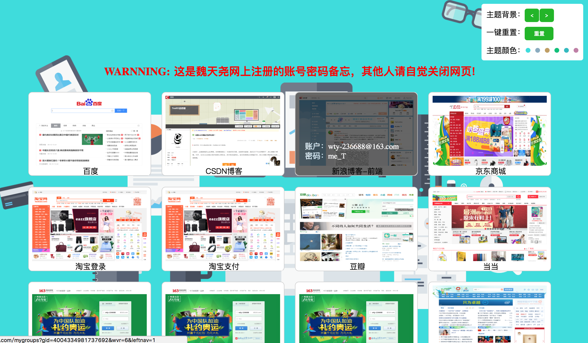

# 个人账号密码备忘
做了一个根据屏幕自适应的个人账号密码备忘网页

使用方法：  
1. 直接打开main.html即可看到网页效果
2. 登录密码在main.js代码的第五行，如图所示。修改‘2368’即可  

3. 登录之后鼠标hover会显示账号和密码，因为纯前端网页，所以这里密码可以给出点提示即可
4. 增加配置项，在main.js里，如下代码：  
```json
websites: [{
	'name': '百度',
	'profile': './img/8.png',
	'href': 'https://www.baidu.com/',
	'account': 'wty2368',
	'password': 'me_N'
}]
```
需要自己截图放到img里，然后加上对应的地址到profile属性；
href是点击图片跳转的地址；
account和password是账号密码

如下所示：  

  

